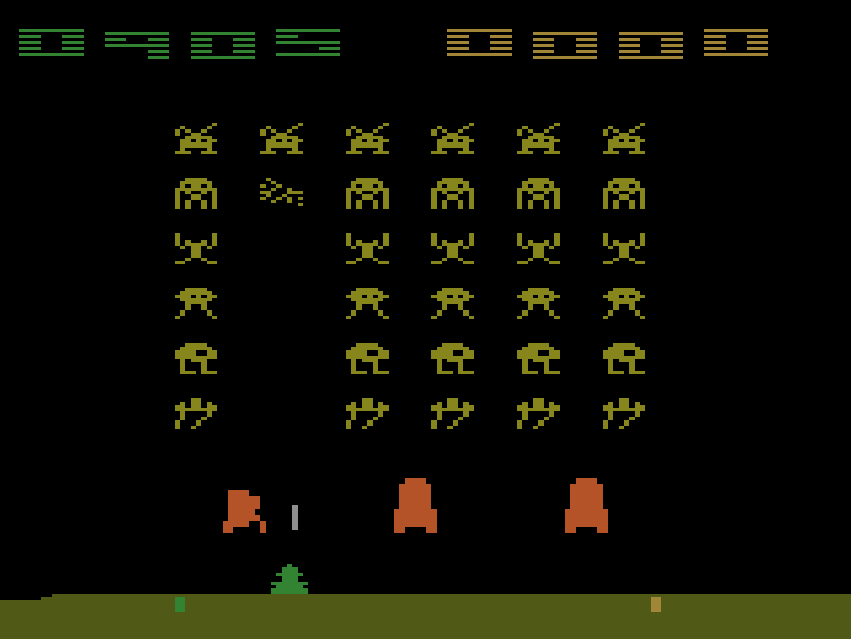

# Info-h410 project

This project implements some reinforcement learning techniques on the space invaders game.



It is realised with the gymnasium library.
The space invaders environment is provided by the gym library at this [link](https://gym.openai.com/envs/SpaceInvaders-v0/).

## Installation

To install the required libraries, run the following command:

```sh
pip install -r requirements.txt
```

## Environnement

The objective is to destroy the space invaders by shooting the laser cannon at them before they reach the Earth. The game ends when all your lives are lost after taking enemy fire, or when they reach the earth.

### Action space

SpaceInvaders has the action space of Discrete(6) with the table below listing the meaning of each action’s meanings.

| Value | Meaning   |
|-------|-----------|
| 0     | NOOP      |
| 1     | FIRE      |
| 2     | RIGHT     |
| 3     | LEFT      |
| 4     | RIGHTFIRE |
| 5     | LEFTFIRE  |

### Observation

Atari environments have three possible observation types: "rgb", "grayscale" and "ram". Theses can be modified by setting the obs_type parameter in the environment constructor. 

The observation space is a Box object that depends on the obs_type parameter:

- obs_type="rgb" -> observation_space=Box(0, 255, (210, 160, 3), np.uint8)  
an RGB image
- obs_type="ram" -> observation_space=Box(0, 255, (128,), np.uint8)  
a representation of the RAM of the Atari machine
- obs_type="grayscale" -> Box(0, 255, (210, 160), np.uint8)  
a grayscale version of the “rgb” type

### Reward

The agent gains points for destroying space invaders. The invaders in the back rows are worth more points.

| Row | Score |
|-----|-------|
| 1   | 5     |
| 2   | 10    |
| 3   | 15    |
| 4   | 20    |
| 5   | 25    |
| 6   | 30    |

# Techniques

2 techniques are implemented in this project:

- Q-learning (see q_learning.py)
- Deep Q-learning (see deep_l.py)

## Usage

### Run

To make the agent play the game, run the 'main.py' file:

```sh
    python main.py
```

You can modify this file to change the technique of to switch between training and testing modes.

### Graphs

To plot the graphs related to the score, run the 'plots.py' file:

```sh
    python plots.py
```

## References

- Deep Q-learning explained: [GeeksforGeeks](https://www.geeksforgeeks.org/deep-q-learning/)
- Deep Q-learning Network pattern used in code: [Keras](https://keras.io/examples/rl/deep_q_network_breakout/)
- Space invaders environment: [Gymnasium](https://github.com/Farama-Foundation/Gymnasium/)

